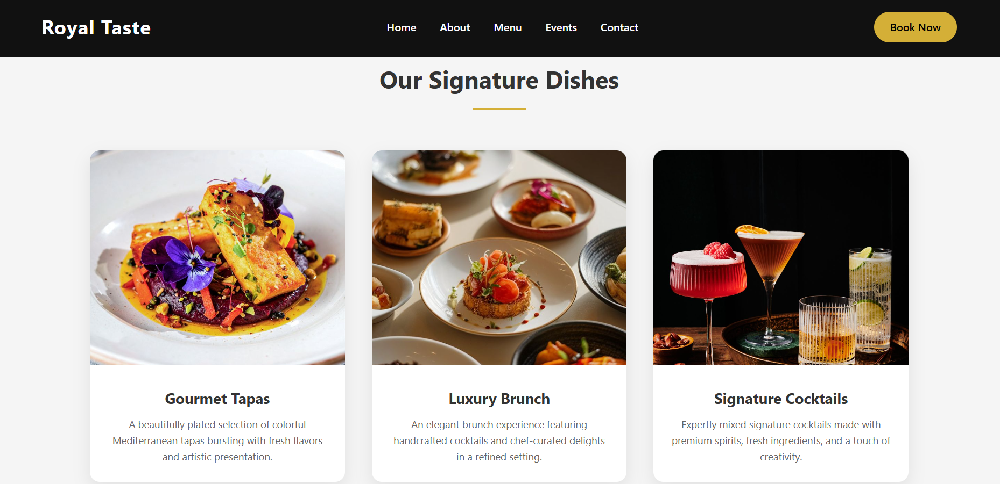
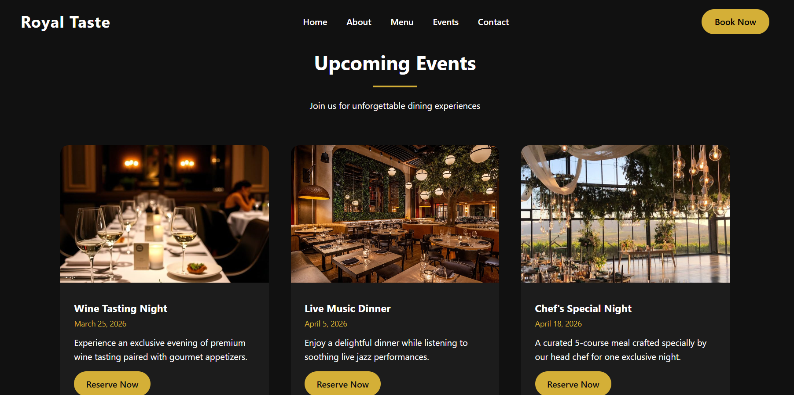

# 🍽️ Royal Taste – Luxury Restaurant Website

A fully responsive **luxury restaurant landing page** built using HTML5 and CSS3.  
Designed to deliver a premium fine-dining digital experience with elegant UI, smooth layout spacing, and visually rich sections.

---

## 🚀 Live Demo
🔗 https://madhuramane-1337.github.io/Restaurant-Webpage/

---

## 🛠️ Technologies Used

- HTML5 (Semantic Structure)
- CSS3 (Flexbox & Responsive Layout)
- Google Fonts
- CSS Transitions & Hover Effects

---

## ✨ Key Features

- 🎯 Fullscreen Hero Section
- 🖼️ Background Image Slider with Dark Overlay
- 📍 Fixed Transparent Navigation Bar
- 📱 Fully Responsive (Mobile & Desktop)
- 🎨 Premium Typography & Spacing
- 🔥 Smooth Hover Animations
- 🧭 Scroll Navigation Links
- 📌 Structured Layout Sections

---

## 📂 Project Structure

RESTAURANT_UI/
│
├── CSS/
│   ├── css/
│   └── style.css
│
├── images/
│
├── screenshots/
│   ├── contacts.png
│   ├── events.png
│   ├── hero.png
│   └── menu.png
│
├── index.html
└── README.md

```

---

## 📸 Screenshots

### 🏠 Hero Section


### 🍽️ Menu Section


### 🎉 Events Section


### 📞 Contact Section


---

## 📌 What I Learned

- Structuring clean semantic HTML
- Building responsive layouts using Flexbox
- Designing premium UI using spacing & typography
- Organizing project folders professionally

---

## 👩‍💻 Author

**Madhura Mane**  
Frontend Developer | HTML • CSS • JavaScript
